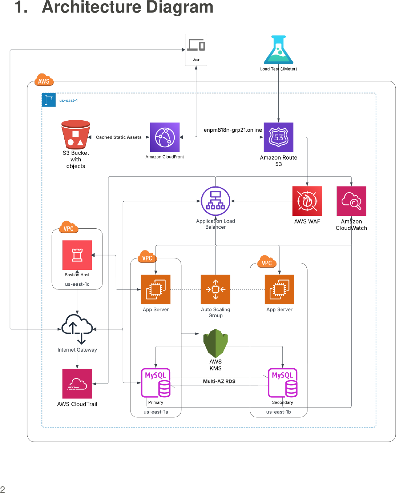

# scalable and secure e-commerce on aws

a three-tier e-commerce platform on aws, built for availability under load and
defence in depth — cloudfront and a waf at the edge, an application load balancer
over an auto scaling group across two availability zones, and a multi-az,
kms-encrypted rds mysql database.

the original project deployed this by hand and load-tested it. this repo is that
architecture written as deployable infrastructure-as-code — six cloudformation
stacks that stand it up end to end — which the report itself lists as the natural
next step.

**[full report (pdf)](report.pdf)** — 29 pages, every phase with console
screenshots and the load-test results. the enpm818n midterm project by group 21 —
mahima rameshkumar shenoy, nimal kurien thomas, shubham sinha and sri harsha
chayanulu varahabhatla, at the university of maryland.

## architecture



the full design, and how each part maps to a template, is in
[`docs/architecture.md`](docs/architecture.md).

## the stacks

six templates, deployed in order — each imports the previous one's exports:

| # | template | tier |
| --- | --- | --- |
| 1 | [`infra/1-network.yaml`](infra/1-network.yaml) | vpc, subnets (public/app/data ×2 az), igw, nat, routing |
| 2 | [`infra/2-security.yaml`](infra/2-security.yaml) | kms key, db secret, security groups, waf web acl |
| 3 | [`infra/3-data.yaml`](infra/3-data.yaml) | rds mysql multi-az, encrypted, tls-only |
| 4 | [`infra/4-edge.yaml`](infra/4-edge.yaml) | route 53, acm cert, s3+oac, cloudfront, alb + listeners |
| 5 | [`infra/5-compute.yaml`](infra/5-compute.yaml) | iam role, launch template, auto scaling group, bastion |
| 6 | [`infra/6-observability.yaml`](infra/6-observability.yaml) | cloudtrail, cloudwatch dashboard, alarms |

## requirements

- the aws cli, configured with credentials for a us-east-1 account
- a registered domain in a route 53 hosted zone (or let stack 4 create the zone)
- [cfn-lint](https://github.com/aws-cloudformation/cfn-lint) to validate locally
- [k6](https://k6.io) to run the load test (optional)

## usage

validate every template:

```
make lint
```

deploy the whole platform in dependency order:

```
make deploy PROJECT=enpm818n-grp21 DOMAIN=your-domain.example
```

or deploy one tier at a time — `make 1-network`, `make 2-security`, and so on.
`make delete` tears everything down in reverse. sample parameters are in
[`params/example.json`](params/example.json).

drive it with the load test (a k6 stand-in for the report's jmeter plan):

```
BASE_URL=https://your-domain.example k6 run loadtest/loadtest.js
```

## results

the six templates validate clean under cfn-lint (version 1.55):

| | |
| --- | --- |
| templates | 6 |
| cfn-lint | 0 errors, 0 warnings |
| resources defined | 67 across the six stacks |

the templates are validated, not deployed here — deploying to aws costs money and
needs an account, so the real deployment and its numbers live in the report. from
the report's jmeter run against the live platform:

| metric | result |
| --- | --- |
| apdex | 1.00 |
| average response time | 19.66 ms |
| 99th percentile | < 100 ms |
| throughput | 50.32 tx/s |
| errors | 0 |
| auto scaling | 1 → 3 instances under load, back to 1 after |
| monthly cost (test window) | ~$3.58, ec2 + rds ≈ 41% |

## note

this reproduces a well-architected reference design, not a vulnerable one — the
value here is the infrastructure-as-code the report didn't have. a few things are
tightened versus the deployed build (the app runs in private subnets behind nat;
the acm certificate is dns-validated automatically), noted in
`docs/architecture.md`. it targets us-east-1; costs accrue while it runs, so use
`make delete` when you are done.
