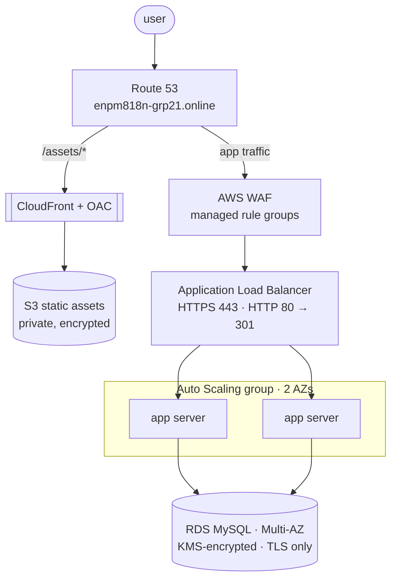

# architecture

The platform is a three-tier web application on AWS, designed for availability
under load and defence in depth. This document explains the design and maps each
part of it to the CloudFormation template that builds it. The original build,
with console screenshots and measured results, is in [`../report.pdf`](../report.pdf).

## request path

Users resolve the domain through Route 53. Static assets (`/assets/*`) are served
from CloudFront, which is the only principal allowed to read the private S3
bucket. Application traffic passes the WAF and reaches the load balancer, which
terminates TLS and spreads requests across the Auto Scaling group; the app
servers talk to a Multi-AZ RDS MySQL instance over TLS.

## the tiers, and where each is built

| tier | template | what it creates |
| --- | --- | --- |
| network | [`infra/1-network.yaml`](../infra/1-network.yaml) | a VPC with public, app and data subnets in two AZs; internet and NAT gateways; a data tier with no route off the VPC |
| security | [`infra/2-security.yaml`](../infra/2-security.yaml) | the KMS key, the database secret, every security group, and the WAF web ACL |
| data | [`infra/3-data.yaml`](../infra/3-data.yaml) | RDS MySQL, Multi-AZ, KMS-encrypted, TLS-required, reachable only from the app tier |
| edge | [`infra/4-edge.yaml`](../infra/4-edge.yaml) | Route 53, a DNS-validated ACM certificate, the S3 assets bucket with OAC, CloudFront, and the ALB with its listeners |
| compute | [`infra/5-compute.yaml`](../infra/5-compute.yaml) | a least-privilege instance role, the launch template, the Auto Scaling group and its target-tracking policy, and a bastion |
| observability | [`infra/6-observability.yaml`](../infra/6-observability.yaml) | a multi-region CloudTrail, a CloudWatch dashboard, and alarms |

The stacks are wired with cross-stack exports, so they deploy in that order and
tear down in reverse.

## design decisions worth calling out

**Availability.** Everything that can span two Availability Zones does: the
subnets, the NAT gateways, the Auto Scaling group, and RDS Multi-AZ. Losing an AZ
degrades capacity but does not take the site down.

**Scaling.** The Auto Scaling group runs a target-tracking policy that holds
average CPU at 50%, with a 300-second warm-up so a newly launched instance has
time to register before it counts — exactly the configuration the report tuned to.
Minimum 1, maximum 3.

**Encryption everywhere.** A customer-managed KMS key encrypts the EBS volumes,
the RDS storage and the database secret. The ALB serves TLS 1.3 with an ACM
certificate; the database refuses any connection that is not over TLS; the S3
assets bucket is encrypted and blocks all public access.

**Least privilege.** The app servers reach the database only on 3306, the
database can be reached only from the app tier, and the app instances carry an
IAM role scoped to read one secret and decrypt with one key — no static
credentials, and IMDSv2 is required.

**Edge protection.** The WAF web ACL runs the managed rule groups from the report
— IP reputation, common rule set, known bad inputs, SQLi and PHP — in front of
the load balancer. CloudFront reaches S3 through Origin Access Control, so the
bucket is never public.

## differences from the deployed build

This IaC is the report's architecture written as code — the report lists
"use CloudFormation or Terraform" as future work, and this is that. A few things
are tightened relative to the screenshots: the deployed build placed the app in
public subnets, whereas this puts the Auto Scaling group in private app subnets
behind NAT; and the ACM certificate here is DNS-validated automatically in the
hosted zone, which removes the manual CNAME step the report called out as a
pain point. The templates are validated with cfn-lint but not deployed here —
the report holds the real deployment and its measured results.
